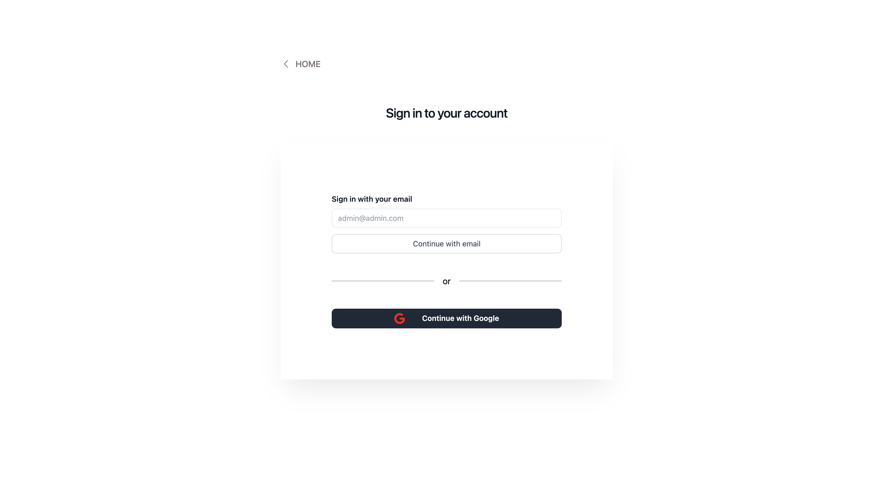

# AI Project Frontend

`Attention! This project is still in development.`  

## Description  
`AI Project Frontend` is a frontend for the AI Project.. The application should allow users to add, edit, view and delete AI projects, and provide visual
reports of the project's status, progress, and other key performance indicators (KPIs).

## Installation  
1. Clone the repository: `git clone https://github.com/ivandi1980/my-aipro-frontend.git`
2. Install the dependencies: `npm install` or `yarn install`
3. Run the application: `npm start` or `yarn start`

## Usage  
1. Open the application in your browser: `http://localhost:3000/`
2. Login with your credentials: `email: admin@ivandjoh.com, password: password`
3. Add, edit, view and delete AI projects
4. View visual reports of the project's status, progress, and other key performance indicators (KPIs)
5. Logout
6. Enjoy!

## Screenshots

#### Workflow Screenshots
  

#### Login Screen

## License
MIT License

## Author  
[ivandjoh](https://linkedin.com/in/ivandjoh)
